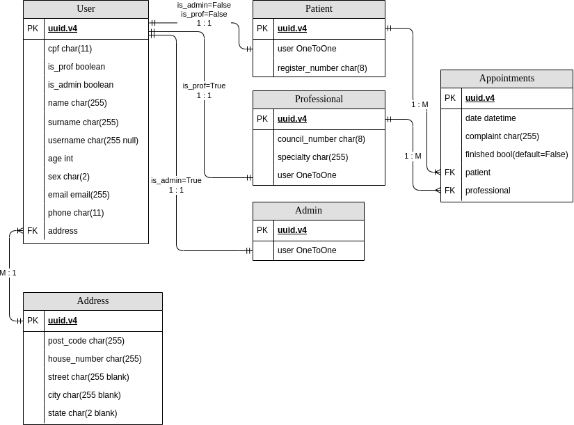

# kenzie_doc_django

- [Translations](#translations)
- [About](#about)
- [Diagram](#diagram)
- [Description](#description)
- [Instalation](#instalation)
- [Documentation](#documentation)
- [API developers](#api-developers)
- [References](#references)
- [Terms of use](#terms-of-use)

<br>

## Translations

- [Português brasileiro / Brazilian portuguese](./.multilingual_readmes/README_pt-br.md)
- [English](https://github.com/AndreKuratomi/kenzie_doc_django)

<br>

## About


<p>The API <b>kenzie_doc_django</b> was made for a clinic logistic. It makes CRUD operations for patients, physicians and secretaries (admins), creates and manages appointments in a simple and intuitive way, as well as manages the waiting queue of the day.

This API also gives the user the possibility to look for professionals by its specialty and also to schedule appointments with the professional chosen in a very simple way.

After the appointment is scheduled, <b>an email is automatically sent</b> for both patient and professional. They are also warned by email if the appointment is updated, finished or canceled. The very same for <b>whatsapp messages</b>.

It uses the language <strong>[Python](https://www.python.org/downloads/)</strong>, its framework <strong>[Django](https://www.djangoproject.com/)</strong> and the database <strong>[SQLite3](https://docs.python.org/3/library/sqlite3.html)</strong>.</p>

<br>

## Diagram

<figure>
    
    <figcaption style="text-align: center">kenzie_doc_django API diagram</figcaption>
</figure>

<br>

## Description

Bellow a brief description of each table listed above, their permissions and their endpoints:

Due to the context that this API works with 3 different types of users that log the API and may perform some specific operations it was decided to work with customized User models. The user models are 'User', 'Patient', 'Professional' and 'Admin':

<h3>User</h3>

<h4>Model</h4>

The User model could be descripted as the API's meta user. For this API it was developed to be the table that has the fields that all the other user tables have in common. The other user models have <b>OneToOne</b> relationship with it.

This model also has a relationship <b>OneToMany</b> with the <b>Address</b> model that is going to be treated afterwards.

The user table doesn't have its own views and endpoints.

<br>

<h3>Patient</h3>

<h4>Model</h4>
The patient model has <b>OneToOne</b> relationship the model User. Its specific field is the <b>'register_number'</b>, a random string with 6 letters, one hyphen and 1 number and generated after its registration.

<h4>Views and permissions</h4>
<b>PatientsView:</b> class view for patient register (POST) and list of all patients (GET).
<br>
<b>Permissions:</b> every logged and not logged user may be registered as patient, but only admins can list all patients.

<br><br>

<b>PatientByIdView:</b> class view for own patient list (GET), update (PATCH) and deletion (DELETE).
<br>
<b>Permissions:</b> every logged admin and the own patient may list and update some fields of its own data, but only admins can delete it.

<h4>Endpoints</h4>
<b>patient/</b>
<br>
<b>patient/<str:patient_id>/</b> -> 'patient_id' it is the patient's <b>register_number</b>.
<br>
<b>Obs:</b> for this version the register_number is case-sensitive.

<br>

<h3>Professional</h3>

<h4>Model</h4>
The professional model has <b>OneToOne</b> relationship the model User. Its specific fields are<br>
    1. the <b>'council_number'</b>, a string with 4 digits, one hyphen and 2 letters generated by the professional's address' postcode (see bellow) and<br> 
    2. his <b>'specialty'</b>.

<h4>Views and permissions</h4>
<b>ProfessionalsView:</b> class view for professional register (POST) and list of all professionals (GET).
<br>
<b>Permissions:</b> only logged admins may register and list professional.

<br><br>

<b>ProfessionalByIdView:</b> class view for own professional list (GET), update (PATCH) and deletion (DELETE).
<br>
<b>Permissions:</b> every logged admin and the own professional may list and update some fields of its own data, but only admins can delete it.<br>
<b>Obs:</b> if the permited user updates the address to a different state the professionals' council_number's final two digits are automatically updated.
<br><br>

<b>ProfessionalBySpecialtyView:</b> class view for listing all professionals registered by their specialty.<br>
<b>Permissions:</b> every logged user may list it.<br><br>
<b>Obs:</b> if the permited user updates the address to a different state the professionals' council_number's final two digits are automatically updated.

<h4>Endpoints</h4>

<b>professional/:</b><br>
<b>professional/<str:council_number>/:</b> -> The API will turn the council_number typed automatically to uppercase.
<b>professional/specialty/<str:specialty>/</str:specialty>:</b> -> The API will capitalize the specialty typed automatically.

<br>

<h3>Admin</h3>

<h4>Model</h4>
The admin (secretary) model has <b>OneToOne</b> relationship the model User and no specific field.

<h4>Views and permissions</h4>
<b>AdminView:</b> class view for professional register (POST) and list of all professionals (GET).<br>
<b>Permissions:</b> only logged admins may list all admins.

<h4>Endpoints</h4>
<b>admin/</b>

<br>

<h3>Address</h3>

<h4>Model</h4>

The address model has <b>OneToMany</b> relationship the model User. It has just two compulsory fields to be filled: <b>house_number</b> and <b>post_code</b>.

This model uses the brazilian lib <strong>brazilcep</strong> that provides the other optional fields 'street', 'city', 'state' if the postcode is given. This lib is used both for the user address registration and also for the professional's council_number:

E.G.: if the admin types '9876' for the professional's council_number and types '20031-170' for the postcode the response will be '9876-RJ'.

As well as the user table, the address one also doesn't have its own views and endpoints.

<br>

<h3>Appointments</h3>

<h4>Model</h4>

<h4>Views and permissions</h4>

<h4>Endpoints</h4>


<br>

## Instalation

<h3>0. It is first necessary to have instaled the following devices:</h3>

- The code versioning <b>[Git](https://git-scm.com/downloads)</b>.

- A <b>code editor</b>, also known as <b>IDE</b>. For instance, <strong>[Visual Studio Code (VSCode)](https://code.visualstudio.com/)</strong>.

- The programming language <strong>[Python](https://www.python.org/downloads/)</strong>.

- A <b> client API REST </b> program. <strong>[Insomnia](https://insomnia.rest/download)</strong> or <b>[Postman](https://www.postman.com/product/rest-client/)</b>, for instance.

- <p> And versioning your directory to receive the aplication clone:</p>

```
git init
```
<br>

<h3>1. Clone the repository <b>kenzie_doc_django</b> by your machine terminal or by the IDE's:</h3>

```
git clone https://github.com/AndreKuratomi/kenzie_doc_django.git
```

WINDOWS:

Obs: In case of any mistake similar to this one: 

```
unable to access 'https://github.com/AndreKuratomi/kenzie_doc_django.git/': SSL certificate problem: self-signed certificate in certificate chain
```

Configure git to disable SSL certification:

```
git config --global http.sslVerify "false"
```

<p>Enter the directory:</p>

```
cd kenzie_doc_django
```
<br>

<h3>2. After cloning the repository install:</h3>

<h4>Virtual enviroment* and update its dependencies with the following command:</h4>


LINUX:
```
python3 -m venv venv --upgrade-deps
```

WINDOWS:
```
py -m venv venv --upgrade-deps
```

In case an error like this one is returned just follow the command displayed:

```
The virtual environment was not created successfully because ensurepip is not
available.  On Debian/Ubuntu systems, you need to install the python3-venv
package using the following command.

    apt install python3.10-venv

You may need to use sudo with that command.  After installing the python3-venv
package, recreate your virtual environment.
```

*It is a good practice to work with virtual enviroments because different projects may need different dependencies. A virtual enviroment is only a separated enviroment from the user machine. If not used, the user's machine may have lots of dependencies intalled that may only be used in a single project.
<br>
<h4>Ativate your virtual enviroment with the command:</h4>

LINUX:
```
source venv/bin/activate
```

WINDOWS:

On Windows operational system it is necessary to configure the Execution Policy at PowerShell:

```
Get-ExecutionPolicy # to check the Execution policy type
Set-ExecutionPolicy RemoteSigned # to change the type of policy if the command above shows 'Restricted'
```
Obs: It may often be necessary to open PowerShell as administrador for that.

```
.\env\Scripts\activate
```
<br>
<h4>Install its dependencies:</h4>

```
pip install -r requirements.txt
```
<br>


WINDOWS:

In case any error similar to the one bellow be returned:

```
ERROR: Could not install packages due to an OSError: [Errno 2] No such file or directory: 'C:\\Users\\andre.kuratomi\\OneDrive - Company\\Área de Trabalho\\kenzie_doc_django\\kenzie_doc_django\\env\\Lib\\site-packages\\jedi\\third_party\\django-stubs\\django-stubs\\contrib\\contenttypes\\management\\commands\\remove_stale_contenttypes.pyi'
HINT: This error might have occurred since this system does not have Windows Long Path support enabled. You can find information on how to enable this at https://pip.pypa.io/warnings/enable-long-paths
```

Run cmd as adminstrador with the following command:

```
reg.exe add HKLM\SYSTEM\CurrentControlSet\Control\FileSystem /v LongPathsEnabled /t REG_DWORD /d 1 /f
```
<br>

<h3>3. Open the aplication with your IDE:</h3>

```
code .
```
<br>

<h3>4. Create <b>.env</b> file:</h3>

./
```
touch .env
```

Inside it we need to put our enviroment variables taking as reference the given file <b>.env.example</b>:

```
# DJANGO:
SECRET_KEY=secret_key

# EMAIL VARIABLES:
EMAIL_HOST_USER=host_email
EMAIL_HOST_PASSWORD=host_password

```

Obs: Do not share info from .env file. It is already mentioned in <b>.gitignore</b> for not being pushed to the repo.

<br>
<h3>5. And run django:</h3>

LINUX:
```
python manage.py runserver
```

or  

```
./manage.py runserver
```

WINDOWS:
```
py manage.py runserver
```


<br>

## Documentation

For full description of endpoints and its responses check the insomnia documentation on the link bellow (necessary free login account) click [here](https://kenziedoc-mk7xydg29-abkuras-projects.vercel.app/).

<br>

## API developers

<div>
    <p>Pierre Kalil - Techlead</p><a href="https://www.linkedin.com/in/pierre-kalil/" target="_blank" ></a> 
    <a href = "https://github.com/Pierre-Kalil"> </a>
</div>

<br>

<div>
    <p>Leonardo Pereira - Product Owner</p><a href="https://www.linkedin.com/in/leonardo-m-pereira/" target="_blank" ></a> 
    <a href = "https://github.com/leokito"> </a>
</div>

<br>

<div>
    <p>André Kuratomi - Scrum Master</p><a href="https://www.linkedin.com/in/andre-kuratomi/" target="_blank" ></a>
    <a href = "https://github.com/AndreKuratomi"> </a>
</div>

<br>

<div>
    <p>Keila Passos - Developer</p><a href="https://www.linkedin.com/in/keila-aparecida-rodrigues-passos" target="_blank" ></a> 
    <a href = "https://github.com/keilapassos"> </a>
</div>

<br>

<div>
    <p>Kaio Iwakiri - Developer</p><a href="https://www.linkedin.com/in/kaio-iwakiri/" target="_blank" ></a> 
    <a href = "https://github.com/kaio-ti/"> </a>
</div>

<br>

## References

- [Django](https://www.djangoproject.com/)
- [Django Rest Framework](https://www.django-rest-framework.org/)
- [Generic views](https://www.django-rest-framework.org/api-guide/generic-views/)
- [Git](https://git-scm.com/downloads)
- [Insomnia-documenter](https://www.npmjs.com/package/insomnia-documenter)
- [Insomnia-documenter (quick tutorial)](https://www.youtube.com/watch?v=pq2u3FqVVy8)
- [Python](https://www.python.org/downloads/)
- [SQLite3](https://docs.python.org/3/library/sqlite3.html)
- [Visual Studio Code (VSCode)](https://code.visualstudio.com/)

<br>

## Terms of use

This project is exclusively for didatic purposes and has no commercial intent.
